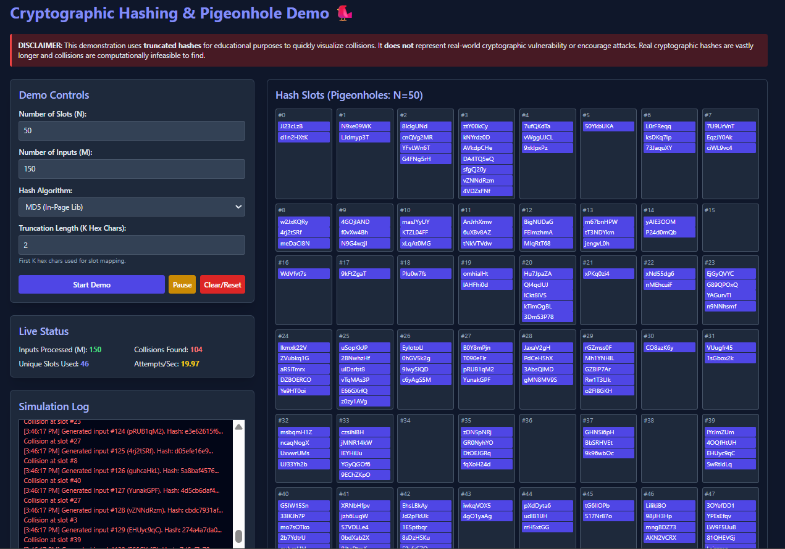

# 🔐 Cryptographic Hashing & Pigeonhole Principle Demo

An interactive, single-file browser demo that visualizes how cryptographic hash functions map inputs into a fixed-size output space and how the **Pigeonhole Principle** guarantees collisions when inputs exceed available outputs.

This project is implemented as a single HTML file (no backend). It uses the browser **Web Crypto API** for SHA-1 and SHA-256 and a built-in MD5 implementation for demonstration. The demo intentionally uses **truncated hashes** for fast, visible collisions — clearly labeled as an educational mode only.

---

## 🔎 What this demo shows

- Animated mapping of randomly generated inputs (“pigeons”) into a fixed number of hash slots (“pigeonholes”).
- Visual collision highlights and simple separate-chaining display inside each slot.
- Live simulated backend-style logs showing generation, hashing, collisions, and attempts/sec.
- Hash inspector to compute MD5, SHA-1, and SHA-256 for arbitrary input and show a JSON-style status block.
- A math panel that computes the truncated output space (`16^K`) and warns when inputs exceed the output space — invoking the Pigeonhole Principle.

---

## ✨ Features

- Single file (`index.html`) — open directly in any modern browser.
- TailwindCSS (via CDN) for responsive UI and styling.
- Uses Web Crypto API for SHA-1 and SHA-256 hashing.
- Includes a small MIT-licensed MD5 implementation embedded in the file.
- Controls for:
  - Number of hash slots (N) — default **100**
  - Number of inputs to generate (M) — default **150**
  - Hash algorithm selector (MD5 / SHA-1 / SHA-256)
  - Truncation length **K** (number of hex chars used to map to slots) — default **2**
  - Start / Pause / Clear-Reset buttons
- Live status panel: processed count, collisions count, unique slots used, attempts/sec.
- Scrollable simulation log with timestamped messages.
- Explanatory sections about hashing, the Pigeonhole Principle, and security implications.
- Educational disclaimer clearly displayed.

---

## 🚀 How to run

1. Download or copy the HTML file (named something like `index.html`).
2. Open it in any modern browser (Chrome, Edge, Firefox, Safari).
   - No server or installation required — the file runs entirely in the browser.
3. Use the controls on the left to configure N, M, algorithm, and truncation K.
4. Click **Start Demo** to begin. Watch as the grid populates and collisions are highlighted.

---

## 🧭 Controls & UI guide

**Demo Controls**
- **Number of Slots (N)** — number of visual pigeonholes (default 100).
- **Number of Inputs (M)** — number of random strings to generate (default 150).
- **Hash Algorithm** — choose `MD5` (embedded lib), `SHA-1`, or `SHA-256` (Web Crypto).
- **Truncation Length (K)** — use the first K hex characters of the hash to map into slots. Smaller K → small output space → collisions appear faster (for education).
- **Start Demo** — begins generating inputs and mapping them to slots.
- **Pause** — pause/resume the demo.
- **Clear/Reset** — reset everything and regenerate inputs.

**Live Status**
- **Inputs Processed** — number of inputs processed so far.
- **Collisions Found** — how many times an input was mapped into a non-empty slot.
- **Unique Slots Used** — number of distinct slots currently used.
- **Attempts/Sec** — processed per second (approx).

**Simulation Log**
- Shows timestamped messages like:  
  `Generated input #35 (abc123). Hash: 4f2b5... Unique placement at slot #12`  
  or  
  `... Collision at slot #42`.

**Hash Inspector**
- Enter any text and click `Compute Hashes` to get MD5, SHA-1, and SHA-256 outputs and a JSON-style result block.

**Math Panel**
- Displays `K` (truncation hex chars), `16^K` (output space size) and `N` (slots).
- Shows clear warnings when `M > output_space` or when `M > N`, explaining that collisions are guaranteed by the Pigeonhole Principle or are very likely.

---

## 🧠 Educational Notes

**What is a hash function?**
- A one-way function that converts arbitrary-length input into a fixed-length digest. Properties: deterministic, avalanche effect, pre-image resistance, collision resistance (practically, not absolute).

**Pigeonhole Principle in hashing**
- If the number of inputs (pigeons) exceeds the number of possible outputs (holes), two different inputs must map to the same output — a collision. This demo visualizes how limiting the output space via truncation achieves this.

**Why collisions matter in cryptography**
- Collisions can break integrity guarantees. Real-world attacks have exploited weak/short hashes (e.g., MD5, SHA-1). Modern systems use long, secure hashes (e.g., SHA-256) to make collision-finding computationally infeasible.

**Important disclaimer**
- The demo uses **truncated hashes** for speed and visualization. This reduces the theoretical security of the hash and is strictly for teaching purposes. Do **not** interpret truncated collisions as proof that full-length hashes (like full SHA-256) are broken.

---

## 🛠️ Implementation details

- **Hashing**
  - SHA-1 & SHA-256: Browser `crypto.subtle.digest()` (Web Crypto API).
  - MD5: In-page JavaScript function included in the file (MIT-licensed code block).
- **Mapping to slots**
  - The demo uses the first `K` hex characters of the hash, converts to an integer, then `mod N` to find the slot index.
  - The demo also supports chaining (list inside each slot) and visually shows multiple items in the same slot.
- **Animation**
  - New insertions flash green; collisions flash red briefly; chaining items appear as a vertical list inside a slot.
- **No network calls** — the whole simulation and logs are generated client-side.

---

## 🧾 Presentation / Demo script (short)

1. Open `index.html` in the browser. Show the **DISCLAIMER** (truncation & ethics).
2. Explain the controls quickly: N, M, K, algorithm.
3. Set defaults (N=100, M=150, K=2), Start Demo.
4. Point to the **Simulation Log** and **Live Status** counters as inputs are processed and collisions occur.
5. When collisions appear, click one colliding item, copy both inputs into the **Hash Inspector**, compute full hashes, and show they differ in full values (demonstrates truncation nuance).
6. Show the **Pigeonhole Math Panel** and explain how `M > 16^K` guarantees collisions.
7. Conclude with security implications (MD5/SHA-1 weaknesses; SHA-256 strength) and the educational nature of truncation.

---

## 📎 License & Credits

- The demonstration HTML file and this README are released under the **MIT License**.
- The embedded MD5 implementation is included for demonstration and is MIT-licensed (credit included in the HTML file).
- No intent or instructions for malicious use are provided — educational purposes only.

---

## 🖼️ Screenshots(Further modifications needed)

### Demo Screenshots 




---

## 🔁 FAQ — Common questions

**Q: Why do collisions appear so quickly?**
**A:** Because the demo uses truncated hashes (small K) and a limited number of slots. This reduces the output space and makes collisions visible on a laptop in seconds.

**Q: Is this a real cryptographic attack?**
**A:** No. This is an educational visualization. Real cryptographic collision attacks against full-length strong hashes require advanced techniques and massive compute resources.

**Q: Can I change the mapping function?**
**A:** Yes — the demo uses parseInt(truncHash, 16) % N. You can modify the mapping logic in the script if desired.

---
```markdown

